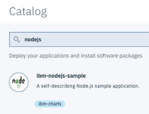
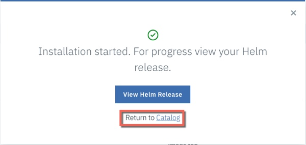
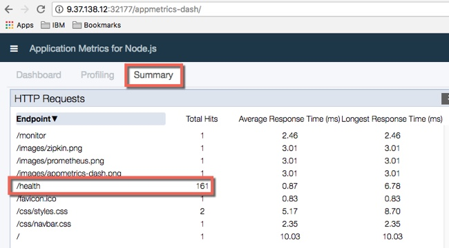

Lab - Deploy a Simple Helm Chart: NodeJS Sample
---

### Table of contents
[1. Create a new Namespace](#namespace)

[2. Deploy the NodeJS Helm Chart using the ICP Console](#consoleDeploy)

[3. Deploy the NodeJS Helm Chart using the Helm CLI](#cmdDeploy)

## Overview
In this lab exercise you will deploy a sample NodeJS Helm Chart.

### Create a new Namespace <a name="namespace"></a>
In this section you will create a new namespace to deploy the Helm Charts in to.

1. If you aren't already logged in to the ICP Admin Console from a previous exercise, open a browser and navigate to `https://<icp_master_ip>:8443` and log in using `username: admin` and `password: icp1nCl0ud`

2. Click **Menu** and then select **Manage > Namespaces** to navigate to the Namespaces page.

3. Create a new Namespace named **helm-lab**. Click **Create Namespace**, enter helm-lab for the name, and click **Create**.

  

### Deploy the NodeJS Helm Chart using the ICP Console <a name="consoleDeploy"></a>
In this section, you deploy, test, and then remove the NodeJS Sample Helm Chart by using the ICP Admin console.

1. Click **Catalog** from the ICP Admin Console menu bar to navigate to the Catalog of Helm Charts.

2. Type **nodejs** in the **Search** field to locate the NodeJS sample.

  

3. Click the **ibm-nodejs-sample** entry in the Catalog to display the readme file. Take a moment to review the readme file for the Helm Chart. This sample is a NodeJS application that runs in a NodeJS Docker Container. The source for the application (and the Helm Chart) can be found here: https://github.com/ibm-developer/icp-nodejs-sample.

4. Click **Configure**.

5. When the *Configuration* screen displays, enter the following information (accept the defaults for all other values), and click **Install**:

  | Parameter       | Value |
  | ------------- |-------------|
  | Release name     | nodejs-sample |
  | Target namespace      | helm-lab      |
  | I have read and agreed to the License Agreements | yes      |
  | Image tag | 8     |

6. When the *Installation started* dialog displays, click **Return to Catalog**.

  

7. Click **Menu**, and then select **Workloads > Helm Resleases** to navigate to the Helm Releases page.

8. Type **nodejs-sample** in the **Search** field to locate the Helm Chart that you just deployed.

  

9. Click the **name** of the Helm Release to drill-down for more information.

10. Note that there are buttons to help with **Upgrade** and **Rollback**.

  

11. Note that there are links to the **Deployment** and **Service** that are created by the Helm Chart.

  

12. Wait for the **Deployment** to be **Available** (value showing 1) before clicking **Launch** in the top right corner of the screen to open a new browser tab and connect to the sample application.

13. Click **Get monitoring** and take a moment to review the documentation regarding app-metrics.

14. Change the URL of the browser from `/monitor` to `/appmetrics-dash` to navigate to appmetrics.

15. Click **Summary** and note that the endpoints in the application are listed, including the **/health** endpoint, which is  continuously checked by Kubernetes to ensure that the application is up and running.

  

16. Close the Appmetrics Dashboard **browser tab**, and return to the **ICP Admin console**.

17. Locate the **nodejs-sample** Helm Release on the **Workloads > Helm Resleases** page again.

18. Click the **Action** link for the **nodejs-sample** Helm Release and select **Delete**.

19. Click **Remove** to confirm.

  You deployed, tested, and removed a release of the NodeJS Helm Chart by using the ICP Admin Console.

### Deploy the NodeJS Helm Chart using the Helm CLI <a name="cmdDeploy"></a>
In this section, you deploy, test, and then remove the NodeJS Sample Helm Chart by using the Helm CLI.

1. If you don't already have one open, open a **terminal** session that is connected to your `boot` node as the **root** user.

2. If not completed in a previous exercise, configure the kubectl command line to connect to your ICP Cluster. Click the **User** icon on the navigation bar in the ICP Admin Console and then select **Configure Client** and copy the commands and paste them in to the terminal window.

3. Run the following commands to log in to the ICP CLI for your ICP Cluster.  

  ```

  cloudctl login -a https://<icp_master_ip>:8443 --skip-ssl-validation
  ```

4. Enter `username: admin` and `password: icp1nCl0ud` when prompted, and select the `mycluster Account` and select the `helm-lab` namespace.

5. Run the following command to initialize the Helm CLI:

  ```
  helm init --client-only
  ```

6. Run the following commands to download the NodeJS Sample from github:

  ```
  cd /tmp

  mkdir nodejs-sample

  cd nodejs-sample

  git init

  git pull https://github.com/ibm-developer/icp-nodejs-sample
  ```

7. Run the following commands to install the NodeJS Sample Helm Chart in to your ICP cluster:

  ```
  cd chart/ibm-nodejs-sample

  helm install --name nodejs-sample-cli --namespace nodejs-lab . --tls
  ```

8. Run the following command to validate that the Helm Chart has been deployed:

  ```
  helm list --namespace nodejs-lab --tls
  ```

9. Run the following command to get the port that was assigned to the Service:

  ```
  kubectl get --namespace nodejs-lab services nodejs-sample-cli-ibm-no
  ```

  The output is similar to that shown below. Locate the **Service port** (in the example below; it is **32457**).

  ```
  # kubectl get --namespace nodejs-lab services nodejs-sample-cli-ibm-no
  NAME                       TYPE       CLUSTER-IP   EXTERNAL-IP   PORT(S)          AGE
  nodejs-sample-cli-ibm-no   NodePort   10.0.0.207   <none>        3000:32457/TCP   1m
  ```

10. Open a browser tab, and navigate to **http://icp-proxy-ip:service-port**. Validate that the NodeJS Sample application is up and running. For example, http://9.37.138.12:32457/.

11. Close the browser tab.

12. Return to the **ICP Admin Console**, navigate to the **Helm Releases** page and verify that the **nodejs-sample-cli** Helm Release is displayed. Drill-down and verify that the **Port** for the Service is the same as what was returned by the CLI.

13. The command to remove the NodeJS Sample Helm Chart is shown below, but you will use the sample app again in the Logging Lab, so leave it running for now.

  ```
  NOTE: DO NOT ISSUE THIS COMMAND AT THIS TIME, IT IS HERE FOR REFERENCE ONLY
  helm delete --purge nodejs-sample-cli --tls
  ```

#### End of Lab Review
  In this lab exercise you deployed your first Helm Chart:
  - Created a new Kubernetes namespace
  - Deployed the NodeJS Helm Chart from the ICP Admin console
  - Deployed the NodeJS Helm Chart by using the Helm CLI

## End of Lab Exercise
